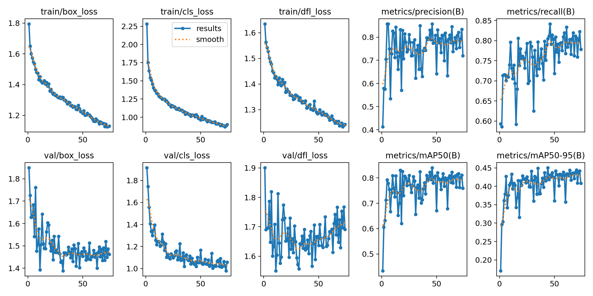
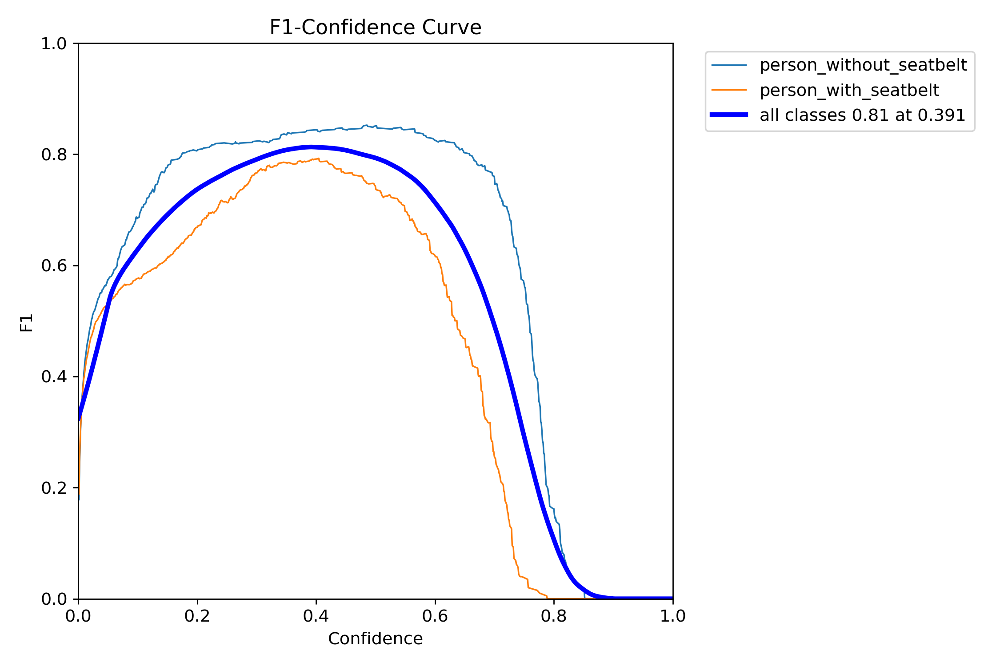
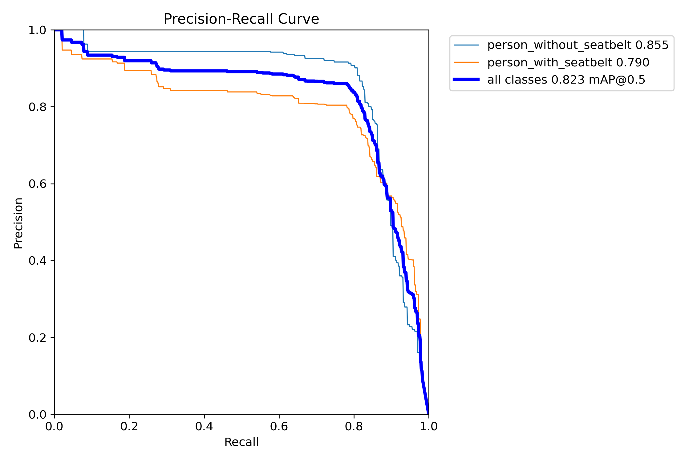
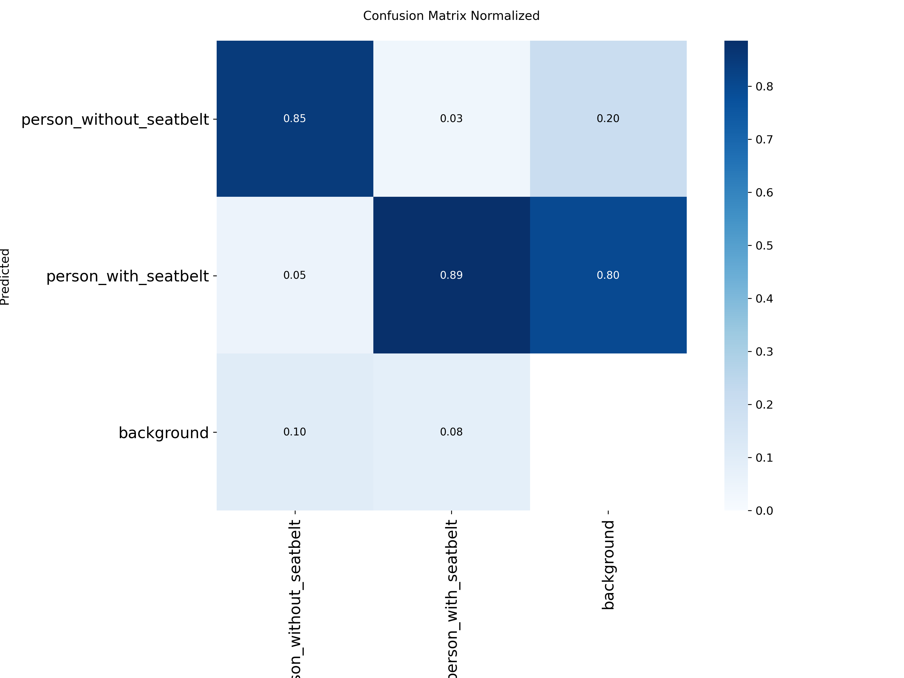
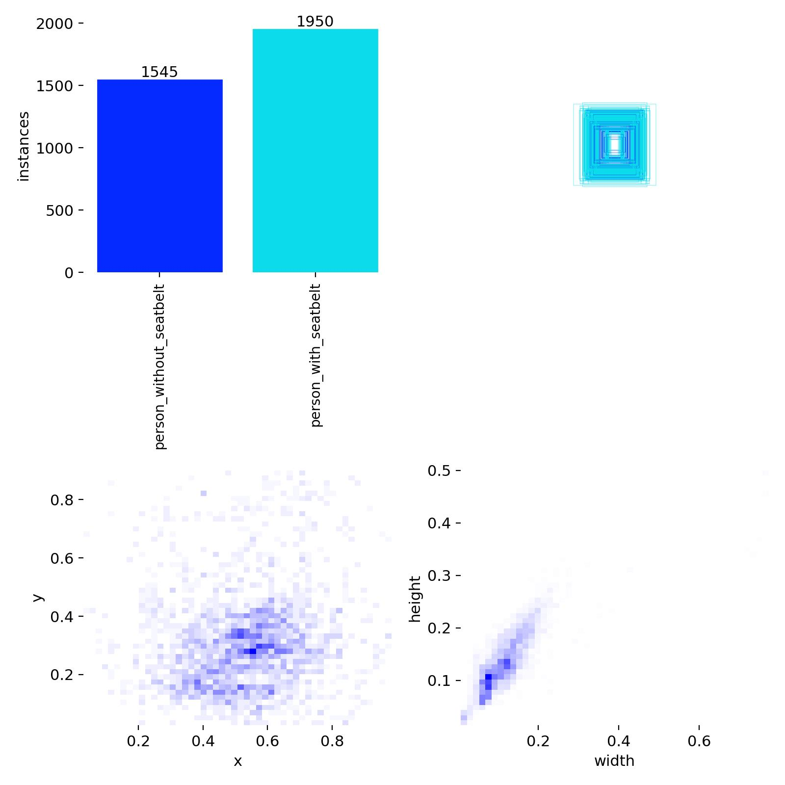
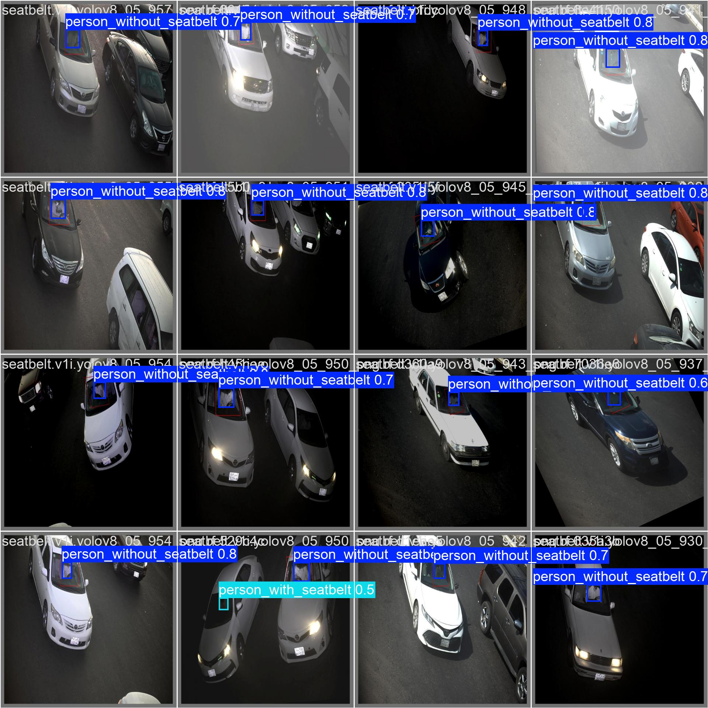

<div align="center">

# 🚗 Seatbelt Detector

### Sistema de detecção de uso de cinto de segurança em tempo real utilizando YOLOv8

Detecção automática de ocupantes utilizando e não utilizando cinto de segurança por meio de visão computacional e aprendizado profundo.

**Treinado com PyTorch e Ultralytics YOLOv8, com suporte a GPU, exportação para ONNX e inferência em tempo real.**

<p>
  
  
  
  
  
  
  
  
</p>

</div>

---

## ✨ Funcionalidades

- 🚗 Detecção de pessoas utilizando e não utilizando cinto de segurança
- ⚡ Inferência em tempo real (~333 FPS em GPU)
- 🧠 Treinamento utilizando YOLOv8n e PyTorch
- 📦 Exportação para ONNX
- 🎯 Avaliação automática com Precision, Recall e mAP
- 📊 Curvas de treinamento e matriz de confusão
- 🖥️ Suporte a imagens, vídeos, webcams e diretórios inteiros
- 🔬 Projeto reproduzível com hiperparâmetros centralizados em `config.py`

---

## 🔗 Links Rápidos

- [Instalação](#instalacao)
- [Dataset](#dataset)
- [Uso](#uso)
- [Resultados do Treinamento](#resultados-do-treinamento)
- [Exportação para Produção](#exportacao-para-producao)
- [Releases](https://github.com/JonathanMar/seatbelt-detector/releases)

---

## 📌 Visão Geral

| Item | Detalhe |
|------|----------|
| Tarefa | Object Detection |
| Modelo | YOLOv8n (3,0M parâmetros) |
| Framework | Ultralytics 8.4.35 + PyTorch 2.11 + CUDA 13.0 |
| Classes | `person_without_seatbelt` / `person_with_seatbelt` |
| Dataset | 7.256 imagens |
| Melhor mAP@50 | **82,3%** |
| Velocidade de Inferência | **≈333 FPS** |
| Exportação | ONNX (opset 17, batch dinâmico) |

---

## 🗂️ Estrutura do Projeto

```
seatbelt_training/
|
|-- config.py                  # Fonte única de verdade: hiperparâmetros e caminhos
|-- train.py                   # Script principal de treinamento
|-- validate.py                # Avaliação de métricas (mAP, Precision, Recall)
|-- export_onnx.py             # Exportação do modelo para ONNX
|-- benchmark.py               # Busca automática do maior batch seguro
|-- requirements.txt           # Dependências Python com versões mínimas
|
|-- dataset/
|   |-- data.yaml              # Template original do dataset
|   |-- _data_resolved.yaml    # Gerado em runtime com paths absolutos (auto)
|   |-- train/
|   |   |-- images/            # 5.840 imagens de treino
|   |   `-- labels/            # Anotações YOLO (.txt)
|   |-- valid/
|   |   |-- images/            # 1.110 imagens de validação
|   |   `-- labels/
|   `-- test/
|       |-- images/            # 306 imagens de teste
|       `-- labels/
|
`-- runs/
    `-- seatbelt_yolov8n/      # Criado automaticamente pelo treinamento
        |-- weights/
        |   |-- best.pt        # Melhor checkpoint (mAP50-95)
        |   `-- last.pt        # Ultimo checkpoint
        `-- ...                # Graficos, métricas, confusion matrix
```

> **Nota sobre `_data_resolved.yaml`:**
> O Ultralytics resolve o campo `path:` do data.yaml relativo ao CWD, não ao
> diretorio do YAML. Para evitar erros de "images not found", o `config.py`
> gera este arquivo com o caminho absoluto correto em cada execucao.

---

## 🖥️ Hardware Testado

| Componente | Especificação |
|---|---|
| GPU | NVIDIA GeForce RTX 2060 SUPER |
| VRAM | 7.6 GB (Turing, sm_75) |
| CPU | Intel Xeon E5-2666 v3 (10 cores / 20 threads) |
| Armazenamento | SSD (cache em disco habilitado) |
| OS | Ubuntu / Pop!_OS (Linux) |

> Para outras GPUs, ajuste `BATCH` em `config.py` ou execute `python benchmark.py`
> para encontrar o batch maximo automaticamente.

---

## 📋 Requisitos

- Python **3.10+**
- CUDA **12.x** ou superior (para GPU)
- pip / ambiente virtual

---

<a id="instalacao"></a>
## ⚙️ Instalação

```bash
# 1. Clonar o repositório
git clone https://github.com/JonathanMar/seatbelt-training.git
cd seatbelt_training

# 2. Criar e ativar ambiente virtual
python3 -m venv env
source env/bin/activate

# 3. Instalar PyTorch com CUDA
#    Verifique a versao correta em: https://pytorch.org/get-started/locally/
pip install torch torchvision torchaudio --index-url https://download.pytorch.org/whl/cu124

# 4. Instalar demais dependências
pip install -r requirements.txt
```

> **Windows:** substitua `source env/bin/activate` por `env\Scripts\activate`

---

<a id="dataset"></a>
## 🗃️ Dataset

### Formato YOLO

O dataset segue o formato padrao YOLO: um arquivo `.txt` de anotacao por imagem,
com cada linha representando uma caixa delimitadora:

```
<class_id> <cx> <cy> <width> <height>
```

Todos os valores em coordenadas normalizadas (0.0 a 1.0).

### Classes

| ID | Nome | Descricao |
|---|---|---|
| 0 | `person_without_seatbelt` | Pessoa detectada SEM cinto de seguranca |
| 1 | `person_with_seatbelt` | Pessoa detectada COM cinto de seguranca |

### Estatisticas do dataset

| Split | Imagens |
|---|---|
| Treino | 5.840 |
| Validação | 1.110 |
| Teste | 306 |
| **Total** | **7.256** |

### Adicionando seus proprios dados

1. Coloque imagens em `dataset/train/images/` e anotações em `dataset/train/labels/`
2. Repita para `valid/` e `test/`
3. Ajuste `nc` e `names` em `config.py` (função `build_dataset_yaml`) se as classes mudarem
4. Não é necessário editar `data.yaml` manualmente

---

## 🔧 Configuração

Toda a configuração está centralizada em `config.py`.
**Nenhum hiperparâmetro está hardcoded nos scripts de treino.**

### Parâmetros principais

```python
# Modelo base (pode ser trocado por yolov8s, yolov8m etc.)
MODEL = "yolov8n.pt"

# Batch — RTX 2060 SUPER (7.6 GB): batch 16 e seguro com YOLOv8n@640
# Use -1 para AutoBatch (YOLO encontra o maximo automaticamente)
BATCH = 16

# Épocas e Early Stopping
EPOCHS   = 150
PATIENCE = 30    # para se não houver melhoria em 30 épocas consecutivas

# Cache — "disk": recomendado para SSD | True: RAM | False: sem cache
CACHE = "disk"

# Mixed Precision (FP16) — Tensor Cores do Turing
AMP = True
```

---

<a id="uso"></a>
## 🚀 Uso

### Treinar

```bash
python train.py
```

O script:
1. Detecta GPU e exibe informações de hardware
2. Gera `_data_resolved.yaml` com paths absolutos
3. Inicia o treinamento com os hiperparâmetros de `config.py`
4. Salva o melhor modelo em `runs/seatbelt_yolov8n/weights/best.pt`

---

### Validar

```bash
# Avaliar no split de validação (padrão)
python validate.py

# Avaliar no split de teste
python validate.py --split test

# Avaliar um modelo específico
python validate.py --model runs/seatbelt_yolov8n/weights/last.pt

# Combinar opções
python validate.py --model runs/seatbelt_yolov8n/weights/best.pt --split test
```

Saída esperada:

```
============================================================
  RESULTADOS DE VALIDAÇÃO
------------------------------------------------------------
  mAP@50        : 0.9241
  mAP@50-95     : 0.7183
  Precision     : 0.9105
  Recall        : 0.8997
============================================================
```

---

### Exportar para ONNX

```bash
# Exportar best.pt com configurações padrão
python export_onnx.py

# Personalizar modelo, resolução e opset
python export_onnx.py --model runs/seatbelt_yolov8n/weights/best.pt --imgsz 640 --opset 17
```

O arquivo `.onnx` é salvo no mesmo diretório do `.pt`.

---

## ⚡ Benchmark de Batch

```bash
python benchmark.py
```

Testa automaticamente os batches `[8, 16, 24, 32, 48, 64]` por 1 epoca cada
e para no primeiro OOM, reportando o maior valor seguro:

```
============================================================
  Maior batch seguro encontrado: 32
  Atualize BATCH = 32 em config.py
============================================================
```

---

## 🎯 Hiperparâmetros

### Otimizador (AdamW + Cosine Annealing)

| Parâmetro | Valor | Descricao |
|---|---|---|
| `optimizer` | AdamW | Convergência rápida com regularização implícita |
| `lr0` | 1e-3 | Learning rate initial |
| `lrf` | 0.01 | Fator de decay: LR_final = lr0 x lrf = **1e-5** |
| `weight_decay` | 5e-4 | Regularizacao L2 |
| `momentum` | 0.937 | Momento do otimizador |
| `cos_lr` | True | Cosine annealing scheduler |
| `warmup_epochs` | 3.0 | Épocas de aquecimento com LR crescente |
| `warmup_momentum` | 0.8 | Momento durante o warmup |
| `warmup_bias_lr` | 0.1 | LR dos biases durante o warmup |

### Augmentação

| Parâmetro | Valor | Descrição |
|---|---|---|
| `mosaic` | 1.0 | Combina 4 imagens — diversidade de contexto |
| `mixup` | 0.10 | Mistura pares de imagens — regularizacao |
| `copy_paste` | 0.10 | Cola objetos entre imagens — melhora recall |
| `close_mosaic` | 10 | Desliga mosaic nas ultimas 10 épocas |
| `hsv_h/s/v` | 0.015 / 0.7 / 0.4 | Variação de matiz, saturação e brilho |
| `degrees` | 5.0 | Rotação aleatória em graus |
| `translate` | 0.10 | Translação aleatória (10% da imagem) |
| `scale` | 0.50 | Zoom aleatorio ate 50% |
| `shear` | 2.0 | Distorção de perspectiva (graus) |
| `fliplr` | 0.5 | Flip horizontal com prob. 50% |
| `flipud` | 0.0 | Flip vertical desativado |
| `label_smoothing` | 0.0 | Desativado; use 0.1 para datasets com ruido |

---

## Resultados esperados

Com os 5.840 exemplos de treino e os hiperparâmetros configurados:

| Metrica | Referencia tipica |
|---|---|
| mAP@50 | > 0.90 |
| mAP@50-95 | > 0.65 |
| Precision | > 0.88 |
| Recall | > 0.85 |

> Os valores reais dependem da qualidade, diversidade e balanceamento do dataset.

---

<a id="exportacao-para-producao"></a>
## 📦 Exportação para Produção

Apos exportar com `python export_onnx.py`, o modelo pode ser usado com:

### ONNX Runtime (Python)

```python
import onnxruntime as ort
import numpy as np

session = ort.InferenceSession(
    "best.onnx",
    providers=["CUDAExecutionProvider", "CPUExecutionProvider"]
)
input_name = session.get_inputs()[0].name
outputs = session.run(None, {input_name: frame.astype(np.float32)})
```

### OpenCV DNN

```python
import cv2
net = cv2.dnn.readNetFromONNX("best.onnx")
net.setPreferableBackend(cv2.dnn.DNN_BACKEND_CUDA)
net.setPreferableTarget(cv2.dnn.DNN_TARGET_CUDA)
```

### Ultralytics (diretamente)

```python
from ultralytics import YOLO
model = YOLO("best.onnx")
results = model.predict("frame.jpg", conf=0.5)
```

---

## 🛠️ Boas Práticas Aplicadas

| Pratica | Implementação |
|---|---|
| Fonte única de verdade | Todos os hiperparâmetros em `config.py` |
| Paths absolutos em runtime | `build_dataset_yaml()` corrige bug do Ultralytics |
| Fail-fast | Paths e arquivos validados antes de iniciar qualquer operação |
| CLI com argparse | `validate.py` e `export_onnx.py` aceitam argumentos |
| Reproducibilidade | `seed=42` fixado em todas as execuções |
| Performance GPU | `cudnn.benchmark=True`, AMP (FP16), cache em disco |
| Early stopping | Para automaticamente se não houver melhoria em 30 épocas |
| Type hints | Todos os modulos com anotacoes (`from __future__ import annotations`) |
| Docstrings | Todos os módulos e funções documentados |
| Encapsulamento | Logica em funcoes; `if __name__ == "__main__"` em todos os scripts |

---

## 🔍 Inferência (Teste do Modelo)

Apos o treinamento, use `predict.py` para testar o modelo em imagens,
videos, webcam ou pastas inteiras. Os resultados sao salvos em `runs/predict/`.

### Instalação rápida

```bash
source env/bin/activate
```

### Imagem

```bash
# Imagem única
python predict.py --source foto.jpg

# Confiança customizada
python predict.py --source foto.jpg --conf 0.4

# Salvar anotações YOLO .txt junto com a imagem
python predict.py --source foto.jpg --save-txt
```

Resultado salvo em `runs/predict/exp/foto.jpg` com as bounding boxes desenhadas.

### Video

```bash
# Video MP4
python predict.py --source video.mp4

# Com nome de saida customizado
python predict.py --source video.mp4 --name teste_video
```

Resultado salvo em `runs/predict/teste_video/video.mp4` com detecções frame a frame.

### Webcam ao vivo

```bash
# Webcam padrão (device 0) com janela ao vivo
python predict.py --source 0 --show

# Segunda webcam
python predict.py --source 1 --show
```

### Pasta de imagens

```bash
# Todas as imagens do split de teste
python predict.py --source dataset/test/images/ --name batch_test
```

### Argumentos disponíveis

| Argumento | Padrao | Descricao |
|---|---|---|
| `--source` | obrigatorio | Imagem, video, diretorio, 0 (webcam) ou URL |
| `--model` | `best.pt` do run atual | Caminho para o modelo `.pt` |
| `--conf` | `0.45` | Confiança mínima para uma detecção ser considerada |
| `--iou` | `0.50` | Threshold IoU para NMS |
| `--imgsz` | `640` | Tamanho de inferência |
| `--show` | `False` | Exibe janela ao vivo (requer display) |
| `--save-txt` | `False` | Salva anotações em formato YOLO `.txt` |
| `--save-conf` | `False` | Inclui score de confiança nos `.txt` |
| `--name` | `exp` | Nome do subdiretório em `runs/predict/` |
| `--device` | GPU (se disponível) | Device: `0`, `cpu`, `cuda:0` |

### Saída do terminal

```
============================================================
  SEATBELT DETECTOR - Inferencia
============================================================
  Modelo  : runs/detect/seatbelt_yolov8n/weights/best.pt
  Source  : video.mp4  [video]
  Conf    : 0.45   |  IoU: 0.50
  Device  : 0
  Saida   : runs/predict/exp/
============================================================

============================================================
  RESUMO DAS DETECÇÕES
------------------------------------------------------------
  Frames / imagens processados : 450
  Pessoas COM cinto            : 312
  Pessoas SEM cinto            : 47
  Total de deteccoes           : 359
  Resultados salvos em         : runs/predict/exp/
============================================================

  ALERTA: 47 deteccoes sem cinto (13.1% do total)!
```

---

<a id="resultados-do-treinamento"></a>
## 📊 Resultados do Treinamento

> **Modelo:** YOLOv8n | **Dataset:** 5.840 treino / 1.110 val | **Hardware:** RTX 2060 SUPER (7.6 GB VRAM)

### Resumo da execução

| Parâmetro | Valor |
|---|---|
| Épocas executadas | **74** (de 150 configuradas) |
| Melhor época | **44** |
| Tempo total | **1h 13min** (1.225 horas) |
| Early Stopping | Ativado: sem melhoria nas últimas 30 épocas |
| Tamanho do modelo | 6.3 MB (`best.pt`) |
| Framework | Ultralytics 8.4.35 + PyTorch 2.11 + CUDA 13.0 |

---

### Metricas finais — split de validacao (best.pt @ epoca 44)

| Classe | Imagens | Instancias | Precision | Recall | mAP@50 | mAP@50-95 |
|---|---|---|---|---|---|---|
| **Todas** | 555 | 687 | **0.829** | **0.805** | **0.823** | **0.450** |
| person_without_seatbelt | 280 | 293 | 0.865 | 0.823 | 0.855 | 0.483 |
| person_with_seatbelt | 325 | 394 | 0.792 | 0.787 | 0.790 | 0.417 |

### Velocidade de inferência (por imagem, GPU)

| Etapa | Tempo |
|---|---|
| Pre-processamento | 0.3 ms |
| Inferência da rede | 1.6 ms |
| Pos-processamento (NMS) | 1.1 ms |
| **Total** | **~3.0 ms (~333 FPS)** |

---

### Curvas de treinamento

Métricas de loss (box, cls, dfl) e mAP ao longo das 74 épocas:



---

### Curva F1 x Confiança

Pico de F1 em torno de confiança 0.4-0.5:



---

### Curva Precision-Recall

Área sob a curva (mAP@50) de 0.823:



---

### Matriz de Confusão Normalizada



---

### Distribuição das anotações no dataset

Distribuição de classes, posição e tamanho das bounding boxes:



---

### Predições no split de validação

Exemplo de detecções do modelo no batch 0 de validação:



As imagens acima ilustram exemplos de detecções realizadas pelo modelo no conjunto de validação, evidenciando sua capacidade de localizar e classificar corretamente pessoas utilizando e não utilizando cinto de segurança.

---

### Análise dos Resultados

#### Pontos Fortes

- Modelo compacto (**3 milhões de parâmetros**) e leve (**6,3 MB**);
- Excelente velocidade de inferência (**≈333 FPS**);
- Boa capacidade de generalização:

```text
Precision : 82,9%
Recall    : 80,5%
mAP@50    : 82,3%
```

- Excelente desempenho na identificação de pessoas sem cinto de segurança (`mAP@50 = 85,5%`), que representa a classe mais crítica para aplicações de fiscalização e monitoramento.

#### Limitações

A classe `person_with_seatbelt` ainda apresenta margem de melhoria:

```text
mAP@50-95 = 41,7%
Recall    = 78,7%
```

Possíveis causas:

- Oclusão parcial do cinto;
- Diferentes tipos e cores de cintos;
- Condições de iluminação variadas;
- Ângulos laterais ou traseiros dos ocupantes.

---

### Trabalhos Futuros

Possíveis estratégias para melhoria:

- Utilizar modelos maiores (`yolov8s` ou `yolov8m`);
- Expandir o conjunto de dados com mais exemplos de cintos parcialmente visíveis;
- Incluir cenários noturnos e diferentes condições de iluminação;
- Aumentar o número de épocas de treinamento (`patience > 30`);
- Aplicar técnicas adicionais de augmentação voltadas para objetos pequenos e parcialmente ocluídos.

---
---

## 📦 Releases

Os pesos treinados, modelos exportados e artefatos de treinamento estão disponíveis na página de releases:

- [Releases](https://github.com/JonathanMar/seatbelt-detector/releases)

Arquivos disponibilizados:

- `best.pt`
- `best.onnx`
- `results.png`
- `confusion_matrix_normalized.png`
- `BoxF1_curve.png`
- `BoxPR_curve.png`
- `labels.jpg`
- `val_batch0_pred.jpg`

---

## 📚 Citation

Se este projeto for utilizado em pesquisas ou trabalhos acadêmicos, cite:

```bibtex
@misc{marcon2026seatbeltdetector,
  author = {Jonathan Marcon},
  title = {Seatbelt Detector: Real-Time Seatbelt Detection Using YOLOv8},
  year = {2026},
  publisher = {GitHub},
  url = {https://github.com/JonathanMar/seatbelt-detector}
}
```

---

## 📄 License

Este projeto está licenciado sob a licença MIT. Consulte o arquivo [LICENSE](LICENSE) para mais informações.

---

### Conclusão

O detector de cintos de segurança baseado em **YOLOv8n** apresentou uma combinação equilibrada entre **precisão, velocidade e baixo custo computacional**. Com **82,3% de mAP@50**, **80,5% de recall** e capacidade de inferência em aproximadamente **3 ms por imagem**, o modelo mostra-se adequado para aplicações de monitoramento em tempo real e pode servir como base para sistemas automáticos de fiscalização do uso de cinto de segurança em veículos.


